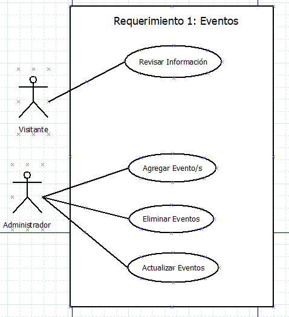
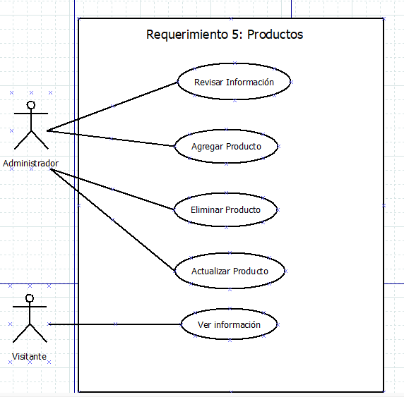
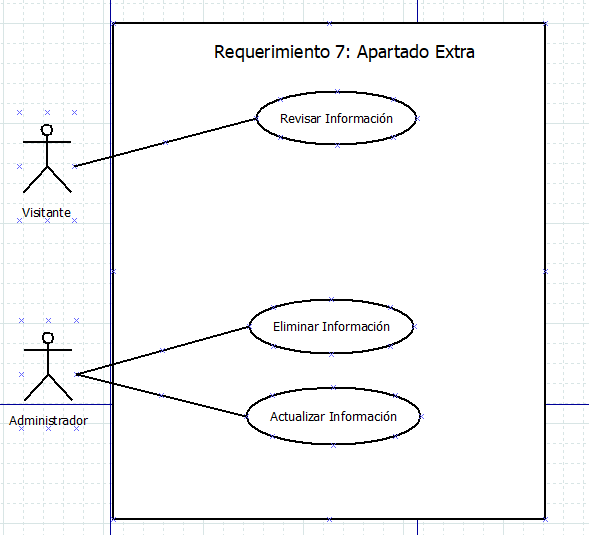

# Casa Iscali

## contenido

  
Tabla contenidos

  <ol>
    <li>
      <a href="#acerca-del-proyecto">Acerca Del Proyecto</a>
      <ul>
        <li><a href="#construido-con">Construido Con</a></li>
      </ul>
    </li>
    <li>
      <a href="#iniciando">Iniciando</a>
      <ul>
        <li><a href="#requisitos">Prerrequisitos</a></li>
        <li><a href="#instalacion">Instalación</a></li>
      </ul>
    </li>
    <li><a href="#uso">Uso</a></li>
    <li><a href="#guias">Guias</a></li>
    <li><a href="#contribucion">Contribución</a></li>
    <li><a href="#licencia">Licencia</a></li>
    <li><a href="#contacto">Contacto</a></li>
    <li><a href="#participantes">Participantes</a></li>
    <li><a href="#referencias">Referencias</a></li>
  </ol>

<!-- Acerca del proyecto -->
## Acerca del proyecto

### Nombre del proyecto
**Casa Iscali**

### Justificación del proyecto

> El servicio al cliente es lo primordial de un servicio y que mejor manera que pueda acceder a él desde cualquier parte del mundo a cualquier hora del día o noche.

> En Casa Iscali podemos ver que la cantidad de nuestros clientes han aumentado y la forma en que ellos necesitan ser atendidos necesita un cambio de ahí la necesidad de crear una página web como una nueva forma para que nuestros clientes obtengan información rápido y desde la comodidad de su hogar, trabajo o cualquier lugar donde se encuentren. 

> Dolores hidalgo es una ciudad donde se puede apreciar que le crecimiento de su población y sus necesidades están en un punto importante y los proyectos como Casa Iscali necesitan adaptarse a las formas actuales de darse a conocer al público, la forma de brindar servicios y como mejorar los servicios que otros proyectos(competidores) o lugares ofrecen. Sabemos que en la actualidad las páginas web son un elemento imprescindible cuando de promocionarse y llevar un registro de los clientes se habla. 

> La página web brindara a nuestros usuarios una forma más rápida para crear unas reservaciones, algo importante de la creación de la página web es para que la persona que está encargada de Casa Iscali tenga una forma más sencilla de llevar el registro de reservaciones, citas y pueda publicar promociones, los servicios que ofrecen en Casa Iscali y los eventos que se celebran para mejorar la experiencia de los clientes. Casa Iscali también necesita que más gente la conozca y la página web puede hacer que el crecimiento sea aún mayor del que tiene actualmente.    

### Objetivo del proyecto: 

> Crear una página web para mejorar la experiencia y los resultados de la asistencia de los clientes de "Casa Iscali", mostrando eventos, promociones, los servicios que se ofrecen y productos, permitiéndole también al proyecto crecer como empresa, así también como facilitar la labor de los administradores de Casa Iscali. Buscando el incremento en la venta de los productos y aumento de los clientes actuales. Sabiendo que los clientes ahora se rigen mucho por lo que encuentran en Internet la creación de la página web intenta dar un salto para la administración de reservaciones(citas) con los profesionales que conforman Casa Iscali.  

### Descripción general del proyecto

> Se creará un circuito que permitirá medir la temperatura en la sala de masajes para tener un control de la misma y que el cliente tenga la mejor experiencia, buscando también optimizar funcionamiento de establecimiento. Además, se creará una página web, en la cual se explicará sobre el establecimiento y sus funciones, es decir; sala de masajes y una consultoría de psicología, así mismo, en la página web se podrán hacer reservaciones(citas) para la consultoría y los masajes, se podrá ver un calendario donde se verán las reservaciones y poder seleccionar el día que esté disponible o sea más cómodo asistir. Además, se crearán secciones para mostrar el trabajo que han realizado estos profesionales, su trayectoria e inicios y como último requisito se creara una sección donde se mostrara el trabajo de un diseñador digital, pintor y profesor de arte que imparte clases los fines de semana. Se añadirán las diferentes formas de contactar a estos profesionales. 

### Material de uso:
<table> <tr> <th>Componente</th><th>Imagen</th><th>Descripción</th><th>Cantidad</th></tr>
  <tr>
    <td> Placa Arduino UNO</td>
    <td>
    
    </td>
     <td><ul>
      <li>Microcontrolador: ATMega328P.
      <li>Velocidad de reloj: 16 MHz.
      <li>Voltaje de trabajo: 5V.
      <li>Voltaje de entrada: 7,5 a 12 voltios.
      <li>Pinout: 14 pines digitales (6 PWM)  y 6 pines analógicos.
      <li>1 puerto serie por hardware.
      <li>Memoria: 32 KB Flash (0,5 para bootloader), 2KB RAM y 1KB Eeprom
       </ul></td>
    <td>1</td>
  </tr> 
  <tr>
    <td>Sensor de temperatura LM35</td>
    <td>
    
    </td>
    <td><ul>
      <li>Modelo: LM35
      <li>Voltaje de alimentación: 4V – 30V (5V recomendado)
      <li>Rango de sensado temperatura: -55℃ hasta +150℃
      <li>Precisión en el rango de -10°C hasta +85°C: ±0.5°C
      <li>Pendiente: 10mV/ºC
      <li>Bajo consumo energético: 60uA
      <li>No necesita componentes adicionales
      <li>Pines: +VCC, V salida, GND
      <li>Baja impedancia de salida
    </ul></td>
    <td>1</td>
  </tr> 
  <tr>
    <td>Display LCD 16x2</td>
    <td></td>
    <td>
      <ul>
        <li>Voltaje: 5 V</li>
        <li>Un pin de selección de registro (RS) que controla en qué parte de la memoria de la pantalla LCD está escribiendo datos. </li>
        <li>Un pin de lectura/escritura (R/W) que selecciona el modo de lectura o el modo de escritura</li>
        <li>Un pin Habilitar que permite escribir en los registros</li>
        <li>8 pines de datos (D0 -D7) . Los estados de estos pines (alto o bajo) son los bits que estás escribiendo en un registro cuando escribes, o los valores que estás leyendo cuando lees,</li>
      </ul>
    </td>
    <td>1</td>
  </tr> 
  <tr>
    <td>Cables </td>
    <td></td>
    <td>
      <ul>
        <li>Conectores tipo A y B que cumplen con el estándar USB
        <li>Excelente conductividad eléctrica
        <li>Aproximadamente 20 cm de largo
        <li>Ideal para utilizar en en computadoras portátiles debido a su longitud
        <li>Elaborado en plástico color azul translucido
        <li>Compatible con cualquier otro periférico o dispositivo USB que tenga los mismos conectores
        </ul>    
    </td>
    <td>2 </td>
  </tr>
  <tr>
    <td>Modulo wifi </td>
    <td></td>
    <td>
      <ul>
        <li>Procesador de 32 bit de bajo consumo
        <li>Velocidad de 80MHz (máximo de 160MHz)
        <li>32 KiB RAM instrucciones, 32 KiB RAM cache
        <li>80 KiB RAM para datos de usuario
        <li>Memoria flash externa hasta 16MiB
        <li>Pila de TCP/IP integrada
        <li>Wifi 802.11 b/g/n 2.4GHz (soporta WPA/WPA2)
        <li>Certificado por FCC, CE, TELEC, WiFi Alliance y SRRC
        <li>16 pins GPIO
        <li>PWM en todos los pines (10 bits)
        <li>Conversor analógico digital de 10 bits
        <li>UART (2x TX y 1x RX)
        <li>SPI, I2C, I2S
        <li>Voltaje de operación 3.0 a 3.6V
        <li>Consumo medio 80mA
        <li>Modo consumo stand-by (1mW) y deep sleep (1uA).
      </ul>
    </td>
    <td>1</td>
  </tr> 

</table>

#### Requerimientos
|No.  |Requerimiento  |
|---  |-------------  |
| 1   |Eventos: La aplicación web tendrá una zona que será llamada eventos donde se podrán revisar las diferentes planeaciones de Casa Iscali donde se verán los eventos con la fecha y el servicio que se ofrece en el evento. |
| 2   |Servicios: Se tendrá de igual forma una zona donde se escribirá la información de los servicios que se ofrecen en Casa Iscali enfocado en los masajes donde se podrá obtener información de su costo, días disponibles para hacer cita, etc.|
| 3   |Historia: Se creará una sección donde las personas podrán revisar la trayectoria de los profesionales en Casa Iscali, donde se mostrarán sus inicios como organización y diferentes certificaciones, títulos y experiencia que han obtenido a lo largo de la existencia de Casa Iscali.|
| 4   |Zona Psicología: Casa Iscali cuenta con varios profesionales que desempeñan diferentes tareas una ellas es psicología, se quiere crear un apartado exclusivo para esto donde se mostrara información de servicios, tipo de ayuda que puede ofrecer y costos.|
| 5   |Productos: En Casa Iscali se ofrecen diferentes productos para los tratamientos terapéuticos que son propios de los masajes, se quiere crear un apartado donde se muestran los productos que se venden en Casa Iscali como cremas, pomadas, café, etc. Se creara una parte donde se podran eliminar, agregar y actualizar la información de los productos y seran almacenados en una tabla de la base de datos. |
| 6   |Promociones: Se quiere un apartado donde se estarán dando información de las promociones que Casa Iscali puede ofrecer por ejemplo por día del niño, día de la madre, etc.|
| 7   |Apartados extra: Se creará un apartado donde se mostrará información de un diseñador digital, que también tiene lazos una serigrafia, también se mostrara información de los costos, paquetes que se ofrecen, etc. |
| 8   |Sensor de Temperatura: Se creará un circuito con Arduino que medirá la temperatura de la sala de masajes donde se esté guardando esta información en una base de datos el circuito buscara en un futuro manipular la temperatura del lugar, aunque se empezará con solo mostrarla en la pantalla LCD. |
| 9   |Manejo de sesiones: Se desarrollara una parte para el manejo de sesiones donde los usarios puede crear, iniciar, cerrar, eliminar y actulizar su información de usuario para el manejo de sesiones. |7

#### Diagrama inicial

### Prototipo

### Diagramas Casos de Uso:
<table> <tr> <th>Requerimiento</th><th>Imagen</th>
  <tr>
    <td>Requerimiento 1: Eventos</td>
    <td>
    
    </td>
  </tr> 
  <tr>
    <td>Requerimiento 4: Servicios</td>
    <td>
    
    </td>
  </tr> 
  <tr>
    <td>Requerimiento 3: Historia</td>
    <td></td>
  </tr> 
  <tr>
    <td>Requerimiento 4: Zona Psicologica</td>
    <td></td>
  </tr>
  <tr>
    <td>Requerimiento 5: Productos</td>
    <td></td>
  </tr> 
  <tr>
    <td>Requerimiento 6: Promociones</td>
    <td></td>
  </tr>
  <tr>
    <td>Requerimiento 7: Apartado Extra</td>
    <td></td>
  </tr>
  <tr>
    <td>Requerimiento 8: Sensor de Temperatura</td>
    <td></td>
  </tr>
  <tr>
    <td>Requerimiento 9: Manejo de Sesiones</td>
    <td></td>
  </tr>
</table>

<!-- Construido con -->

<!-- Construido con -->
### Construido con

<ul>
  <li> Python v3.10.5 Link video YouTube: https://www.youtube.com/watch?v=HdO_fU3OA14
  <li> Visual Studio Code v1.70.0 Link video YouTube: https://www.youtube.com/watch?v=7EAFKJXTq30
  <li> Django 
  <li> VirtualEnv 
  <li> Arduino Uno
  <li> Arduino IDE v1.8.19 Link video YouTube: https://youtu.be/1uQca71604c 
</ul>

<!-- Iniciando -->
## Iniciando
Iniciando.

<!-- Requisitos -->
### Requisitos
Requisitos.

<!-- Instalación -->
### Instalacion
Instalación.

<!-- Uso -->
### Uso
Uso.

## Guias
Guias.

## Contribucion
Contribucion.

## Licencia
Privado

## Contacto
<ul>
  <li>Nombre: Pablo Uriel Rosas Vargas
  <li>Correo: urielvargas127@gmail.com
  <li>Num. Celular: 418 139 7629 
</ul>

## Participantes
* [Pablo Uriel Rosas Vargas]()
* [Gabriel Barrón Rodríguez]()
* [Christopher Ivan Garcia Avila]()

[contribuidores-shield]: https://img.shields.io/github/contributors/github_username/repo_name.svg?style=for-the-badge
[contributors-url]: https://github.com/github_username/repo_name/graphs/contributors

## Referencias
### Imagenes
<ul>
<li>Amazon. (s.f.). Amazon. Obtenido de Google: https://m.media-amazon.com/images/I/71z22cRPeeL.jpg
<li>Github. (s.f.). Github.com. Obtenido de Google: https://user-images.githubusercontent.com/8560750/166756741-813b8a4a-d952-4e20-aa89-b7699ffeb30d.jpg
<li>Leantec. (s.f.). leantec.com. Obtenido de Google: https://leantec.es/wp-content/uploads/2018/02/p_6_8_1_681-40-CABLES-MACHO-HEMBRA-10cm-jumpers-dupont-254-arduino.jpg
<li>ratytec. (s.f.). ratytec.com. Obtenido de Google: https://natytec.com.mx/wp-content/uploads/2018/10/lm35dz.jpg
<li>rdteam. (s.f.). rdteam.mx. Obtenido de Google: https://rdteam.mx/wp-content/uploads/2020/11/762365-mla31063767605_062019-o-233358ad17b62cb14815638265858625-640-0.jpg
</ul>

